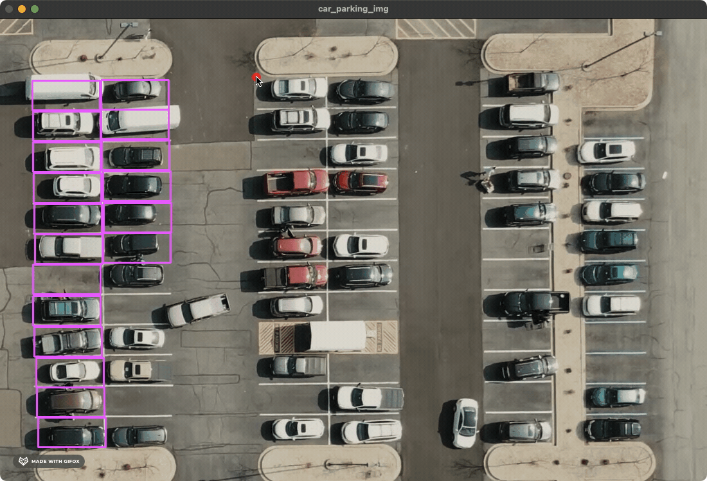
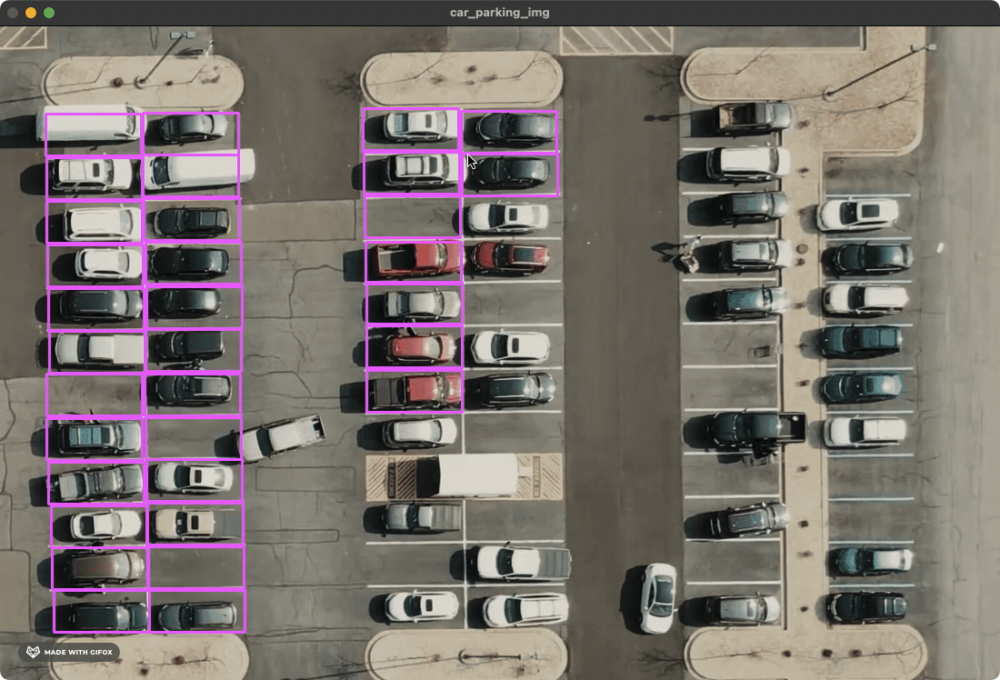
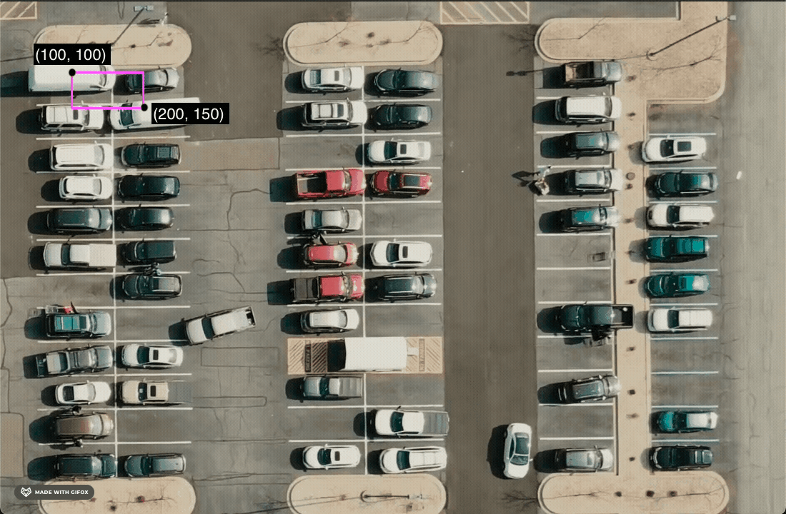

# Parking Space Counter
A Python-based application that shows the availability of parking spaces. It is implemented using computer vision algorithms.

This application allows you to select parking spaces. The parking space counter then processes those selected parking spaces in order to know the status of a parking space.

This application is implemented by referring [this tutorial (provided by Murtaza's Workshop - Robotics and AI)](https://www.youtube.com/watch?v=caKnQlCMIYI) and adapted with own needs accordingly.

## Prerequisite
For reproducing the results for this repository:
- Ensure Python 3.9 environment
- Within the `src` folder, place
  - a birds-eye view image of a parking lot named `car_parking_img.png`
  - a birds-eye view video of a parking lot named `car_parking_video.mp4`

For integrating with cameras:
- Configure a birds-eye view camera setup
- Stabilize the camera at a fixed angle
- Capture video stream by [specifying the source](src/main.py#L49)
- Ensure Python 3.9 environment

## Installation
1. Clone the project and change directory to the project
   ```bash
   git clone https://github.com/adelinewei/parking-space-counter.git
   cd parking-space-counter
   ```
2. Create a Python virtual enviornment
   ```bash
   python -m venv .venv
   ```
3. Activate created Python virtual environment
   ```bash
   source .venv/bin/activate
   ```
4. Install dependencies
   ```bash
   make install
   ```

## Usage
### Parking Space Picker
Open the picker
```bash
make picker
```
Select parking space by left click


Unselect parking space by right click


Press `q` to quit the picker

### Parking Space Counter
Start parking space counter
```bash
make start
```
Show free parking spaces in green, occupied spaces in purple and the status bar as well.


Press `q` to quit the counter

## Implementation Details
For learning purpose, I listed down the thoughts of building this application step by step.
### Parking Space Picker
1. Decide the size of a parking space by trying out different combinations of coordinates. Each purple rectange shown below was drawn by a pair of top-left and bottom-right points accordingly. \
   *The coordinates (50, 97), (155, 143) is a perfect fit for a parking space. Which means the width is 105, height is 46.*
   
2. Set up events triggered by mouse clicks to draw a rectange or remove a rectangle, and store the coordinates in a file.
3. Read selected coordinates from the file, and draw rectangles irrespectively.
4. Configure the "q" button event for quitting the picker


### Counter
1. Process captured frame by applying various algorithms \
   *Algorithms: gray, gussian blur, adaptive, median blur threshold and dilate*
   
2. Crop loaded frame based on the coordinates selected by picker
3. Count non-zero pixels in each cropped image
4. Define the threshold of so-called free parking space (i.e., non-zero pixels larger than 900)
5. Draw rectangles and text in different colors accordingly
6. Show the availability information (free spaces / total spaces)
7. Switch input source to video and play it infinitely
8. Configure the "q" button event for quitting the counter

## Project status
In progress